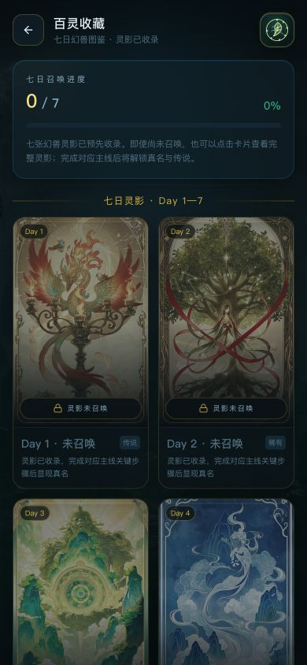

# FOWORLD · 兴义寻灵记

面向贵州兴义七日实景探索的移动端 LBS 幻想体验。项目以万峰林、万峰湖、马岭河峡谷与布依文化为灵感，将定位、方向传感、相机/AR、解密小游戏和七日剧情整合为一套“灵域操作系统”。

## 百灵收藏

七张东方幻想幻兽卡面已收录为 Day 1–Day 7 图鉴。未召唤状态可查看完整灵影，完成对应主线后解锁幻兽真名、元素与传说。



## 主要功能

- 寻灵罗盘、GPS 定位与任务地图
- 七日主线、支线和任务环节试玩台
- 相机、AR、方向传感与移动端体感游戏
- 七日幻兽图鉴与百灵收藏
- 灵源、碎片、记录和兑换系统
- 响应式移动端暗色东方幻想 UI

## 技术栈

- React 19 + TypeScript
- Vite 8 + Tailwind CSS 4
- Framer Motion
- Leaflet / React Leaflet
- Lucide React

## 本地运行

```bash
npm install
npm run dev
```

开发服务默认使用 HTTPS，并监听 `5173` 端口。

## 构建与检查

```bash
npm run build
npm run lint
```

## 项目说明

当前版本用于兴义线路内测。浏览器无法获取真实定位或设备方向时，会显示本地 Mock 数据；涉及方向传感与相机的环节建议在移动设备上通过 HTTPS 访问。
